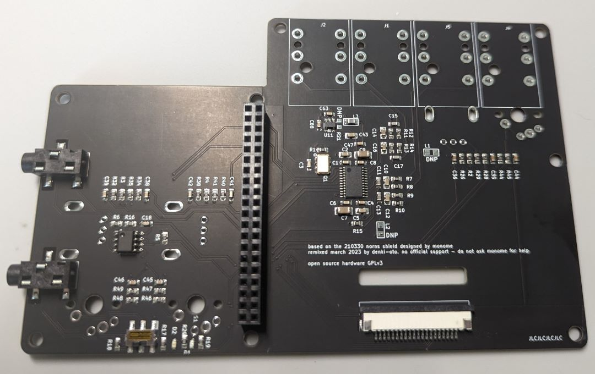
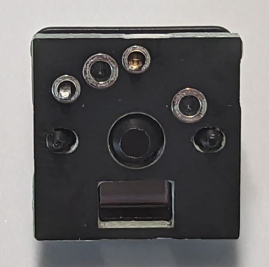
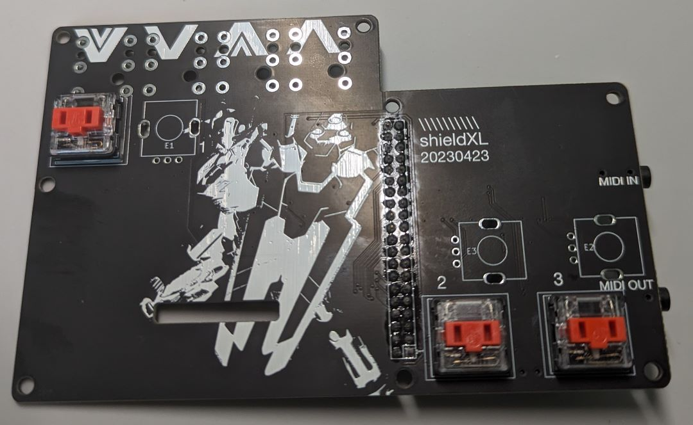
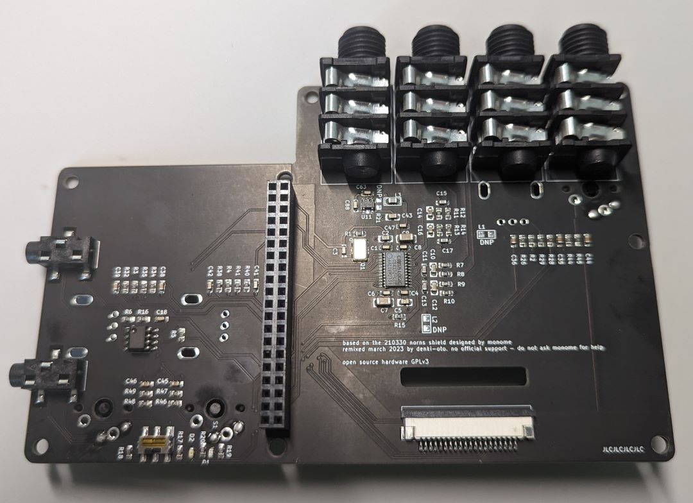
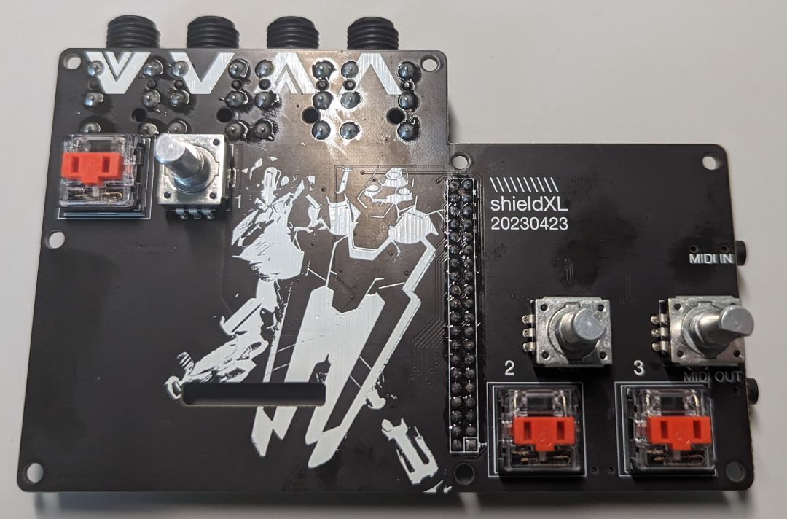
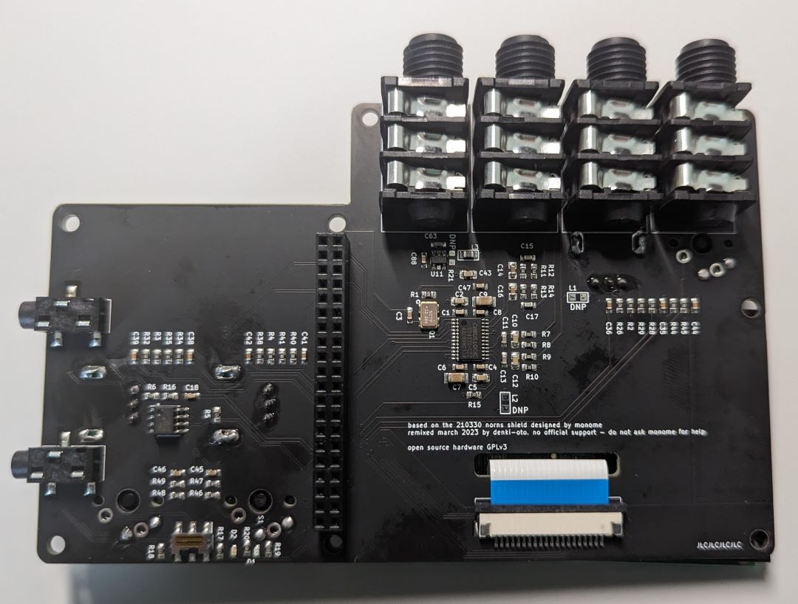
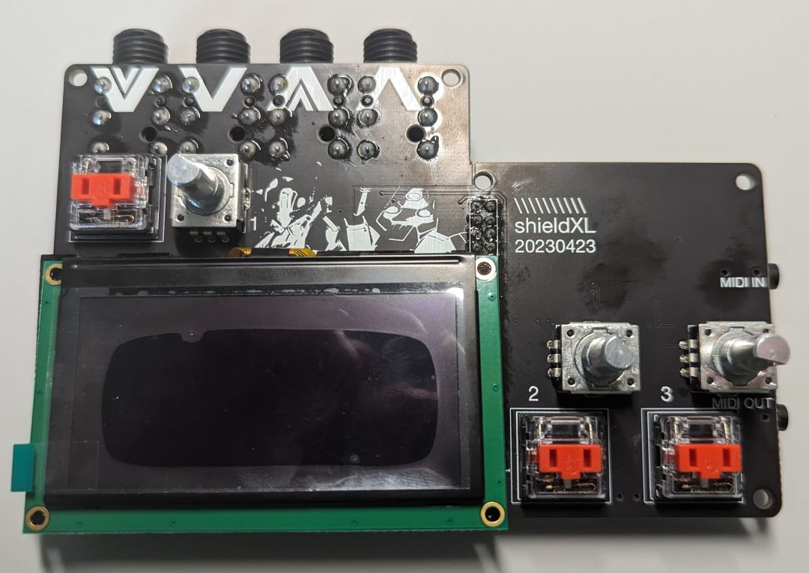
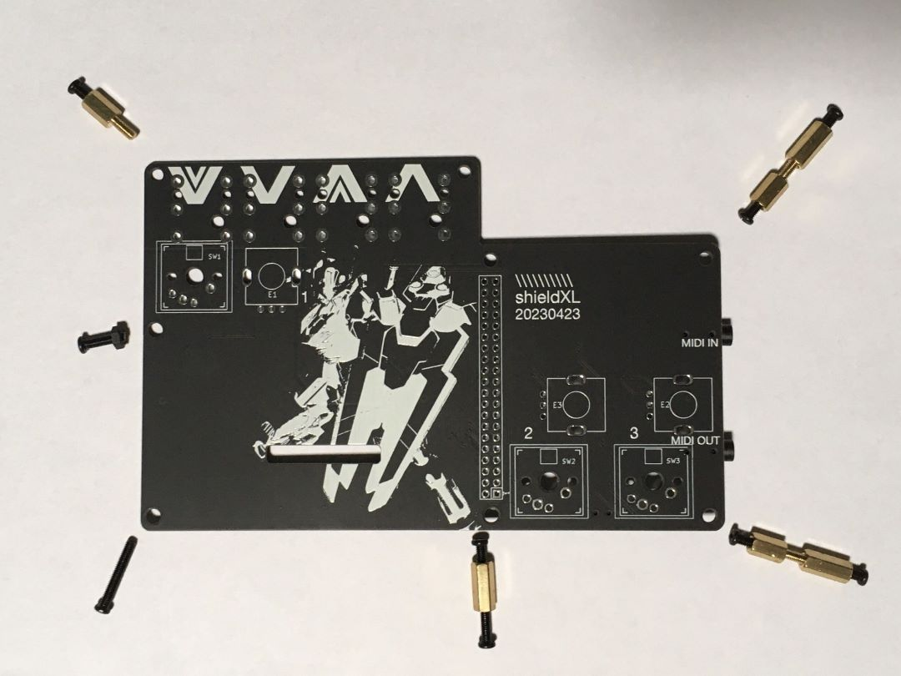
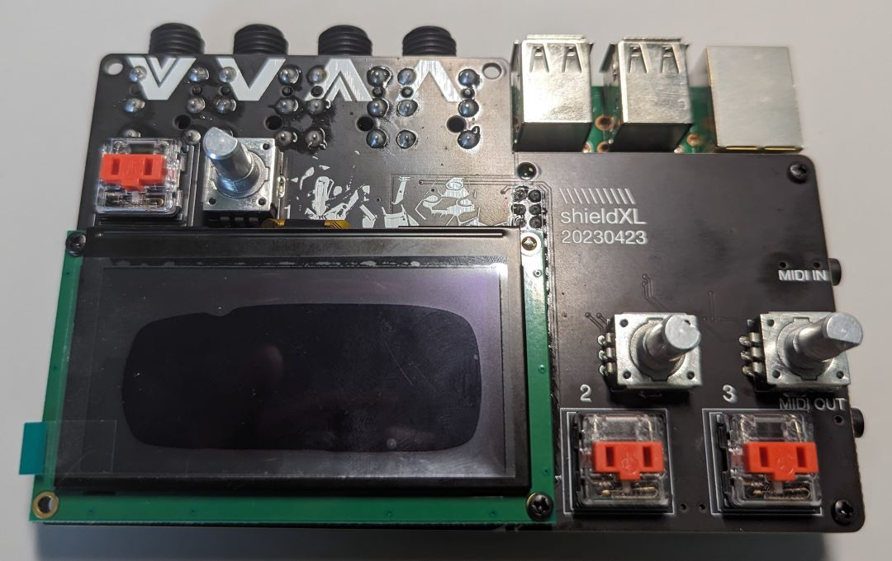
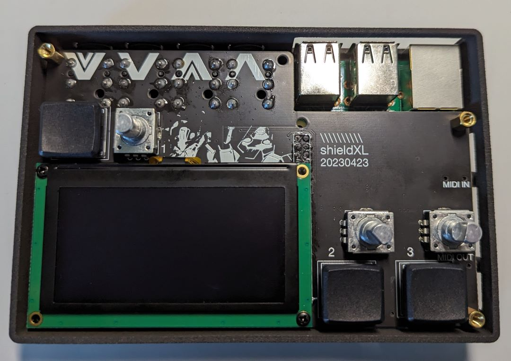

# shieldXL Build Guide

[Video build guide playlist](https://youtube.com/playlist?list=PLYhX2rtncmtN1OSebuMCquus0ssT5jDe1)

PCBs sourced from denki-oto will include a few extras:

* PCB spacers for Choc switches (see build notes below) - not needed for MX switches  
* Acrylic display spacer - this is a 3mm thick acrylic spacer to support the OLED display

For soldering help/tips see this awesome [guide from Adafruit](https://learn.adafruit.com/adafruit-guide-excellent-soldering/common-problems)  

## Build

[Video instructions](https://youtu.be/Cyyh8wZTWDU)

### Pi header

The pi-header attaches from __the bottom__ of the PCB

### Switches

If using Choc switches, use included PCB spacers between the switch and the main PCB. There should still be enough pin sticking through to solder these in one go. These are meant to raise the switch body up to a better level with the encoders.  

__NOTE__ - be sure the switch position is nice and square in relation to the other parts - not rotated at all - so your keycaps don't end up looking wonky in the end.  

### Jacks

The jacks attach from __the bottom__ of the PCB

### Encoders

### Attaching the display

[Video instructions](https://youtu.be/nq_Z90EFWEE)

The OLED uses an FPC cable to attach. This runs through the hole in the PCB to the connector on the bottom.

* Attach the cable to the display first and then connect it to the board
* Slide the connector open with a spudger or a fingernail  
* Insert the FPC cable with the blue side facing up (away from the PCB)  
* Be sure the cable is inserted properly - with about half the blue portion showing  
* Snap the connector closes with your finger/fingernail  
* The angle needed to slide the cable inserted can sometimes be tricky  
* Be sure to put the display spacer in place before final attachment of the FPC cable  
* It can be tricky to get that in place with the shorter (30mm) FPC cable
* The bottom right screw hole can be used to secure the display to the main board and Pi  

### Attaching the Pi / Case Assembly

[Video instructions](https://youtu.be/K84_22LJrQo)

