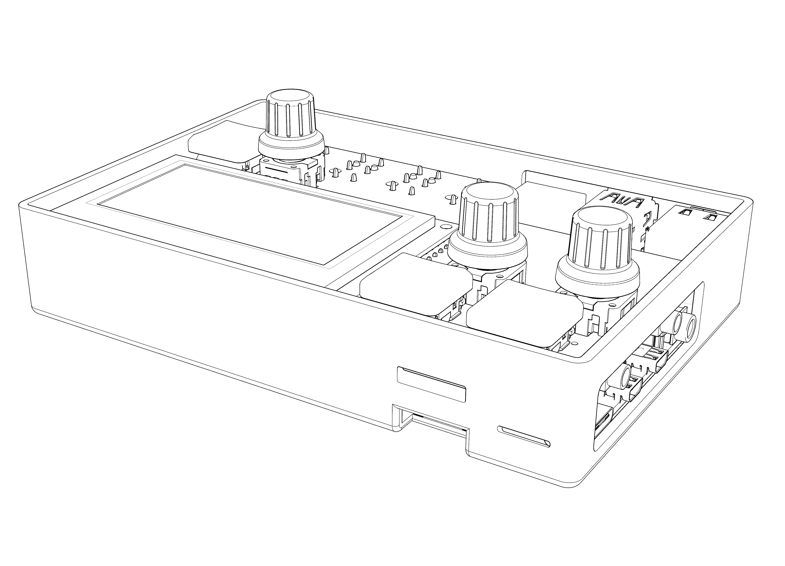

# shieldXL

A rework/remix of the monome norns shield - an open-source/DIY shield for Raspberry Pi boards, providing hardware compatibility with the [norns](https://monome.org/docs/norns) ecosystem. Original designed by monome (brian crabtree, aka @tehn). Remixed in spring 2023 by denki-oto.

__Please be very aware that this project is not directly supported by [monome](https://monome.org). Do not email monome asking for build help, debugging or repairs__



## specifications

- audio codec: CS4270  
- audio jacks: 6.5mm in and out, line level  
- OLED: NHD-2.7-12864WDW3-M (w/ MOLEX connector)  
- 3x pushbutton switches, 3x rotary encoders  
- dimensions (with enclosure): 138mm x 96mm x 30mm  

## versions

__shieldXL 20230423__
This rework/remix is based on the 210330 version of the norns shield. It uses the same disk image as the 210330 shield with the cs4270 codec.

## documentation

[See the monome website for general norns shield documentation](https://monome.org/docs/norns/shield/) 

## build

[Bill of Materials](bom/BOM.md)

[Build Guide](BUILD.md)

## installation

See [https://monome.org/docs/norns/help/#fresh-shield](https://monome.org/docs/norns/help/#fresh-shield) for installation instructions.  

See [norns releases on github](https://github.com/monome/norns-image/releases/tag/231114-img) for disk images (pre-211028 shield for cs4270 codec).   

Pi3 disk image:    
*  [norns231114-shield-pi3](https://github.com/monome/norns-image/releases/download/231114-img/norns231114-shield-pi3-cs4720.tgz)

Pi4 disk images (Try starting with 220306. If you get a blank screen, try starting over with 231114):  
* Pi4 220306 [norns220306-shield-pi4](https://github.com/monome/norns-image/releases/download/220306/norns220306-shield-pi4-cs4270.tgz)  
* Pi4 231114 [norns231114-shield-pi4](https://github.com/monome/norns-image/releases/download/231114-img/norns231114-shield-pi4-cs4720.tgz)  

REMEMBER TO EXPAND THE DISK IMAGE AFTER INSTALL  
[https://monome.org/docs/norns/shield/#expand-filesystem](https://monome.org/docs/norns/shield/#expand-filesystem)

## enabling hardware midi

```
cd ~
git clone https://github.com/okyeron/shieldXL.git
cd ~/shieldXL 
./install-midi.sh
```
Then Edit `/boot/config.txt` 

`sudo nano /boot/config.txt`  

and add the following  
 
```
enable_uart=1
dtoverlay=miniuart-bt
dtoverlay=uart0
dtoverlay=midi-uart0
```
Then edit `/boot/cmdline.txt` 

`sudo nano /boot/cmdline.txt`  

and remove `serial0`    
(so change `console=serial0,115200` to `console=115200`)  
and `sudo reboot`  

This will internally connect the shieldXL hardware TRS MIDI jacks to the "Virtual MIDI" port which is accessible from the norns MIDI menu (SYSTEM>DEVICES>MIDI).  

__MIDI Troubleshooting__   

- When checking MIDI functionality, remember that MIDI OUT has a Type A/B switch on the bottom front edge of the main PCB. Try switching that if you're not getting MIDI to your device.

## mods

__Battery Modication__  
Add a Pisugar S Plus battery to your shieldXL:  https://github.com/JGuzak/shieldXl_battery  


## general troubleshooting

- Most soldering problems can be solved simply by reheating solder joints. Bad solders can result in various problems: screen doesn't turn on, knobs/keys don't work.
- Use a good SD card, not a cheap one. If you're having trouble, try using a different card.
- Be sure to use the correct power supply. The pi will not power well from a laptop and you'll get confusing errors. Get a dedicated 3A USB supply, or very high output USB battery.
- see the [norns documentation](https://monome.org/docs/norns/shield/) for help with the software  

## notes

- The shield does not have a dedicated headphone output, but headphones work fine on the main outputs (use the left output jack). The headphone gain level within the norns menu does nothing in this case.
- The battery indication will not function - there is no battery.

## License

[GNU GENERAL PUBLIC LICENSE](LICENSE.txt)
