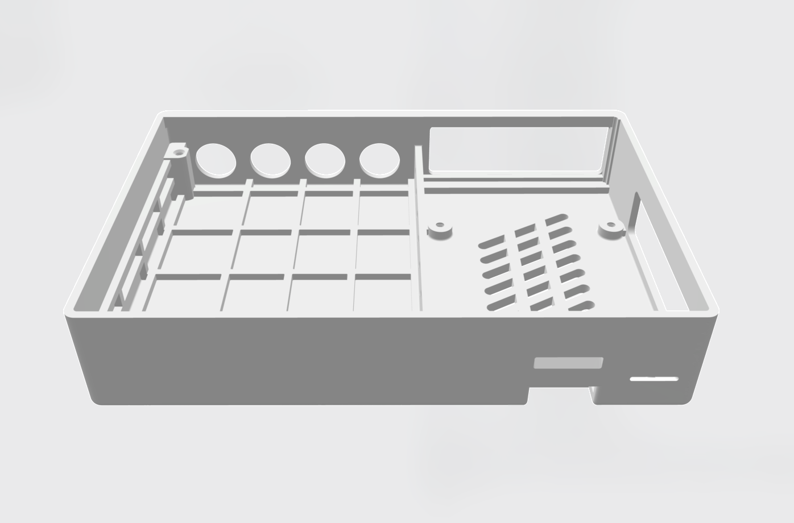
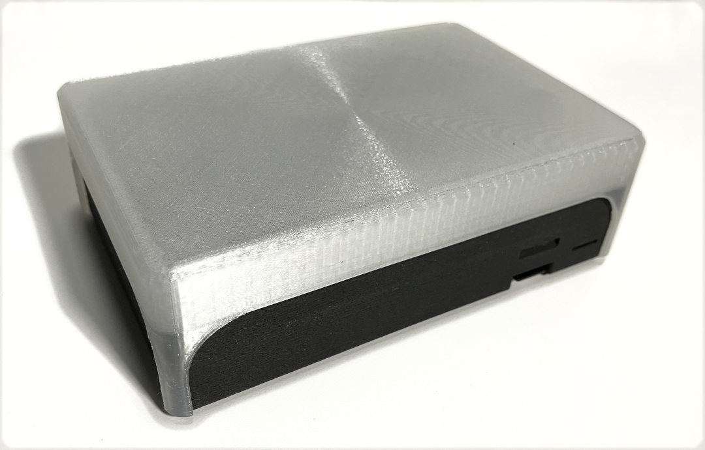

# shieldXL case/enclosure info

## credits

Models for 3D printing provided by CarlosUnch, John Park and Steven Noreyko  

Top panel files by Steven Noreyko  

## models for 3d printing

`shieldXL_case_v1.4.4-FDM` is probably best for home FDM printers (PLA, etc.)  

`shieldXL_case_v1.6.4-SLS-Nylon` is optimized for commercial SLS Nylon printing. (from JLCPCB, etc.)  

Use the STL file for ordering from 3D printing services or printing yourself.  

Use the STEP file if you're wanting to customize/modify the model.  

Models are setup for M2.5 screws. 

## dimensions

pcb dimensions: 132.7mm x 85mm  

top panel dimensions: 138mm x 92mm  

keyswitch holes: 19mm x 19mm

encoder holes: 8mm

mounting holes: 3mm

enclosure dimensions: 138mm x 96mm x 30mm  

## shieldsaver 

design by "rm"  [https://github.com/roge-rm](https://github.com/roge-rm)  

a "decksaver" cover for the standard 3d printed cases.

